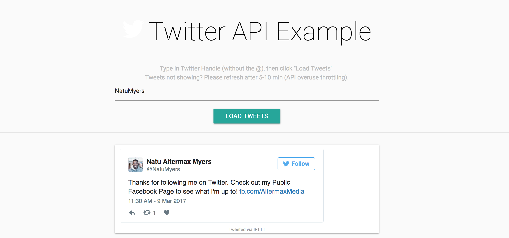

### How to Start Up

Clone or Download

Assuming you have already installed Node.js, run ``nodemon`` - this will start the server at port 8000

Open your browser and hit ``localhost:8000`` to view page

Type in the twitter handle and type enter

Scroll to the bottom of the page to **get more tweets** or hit the **Top** button to go back to the top of the page

(If the results don't show the API may have been hit too much and is throttling. Simply wait five minutes and hit refresh)
